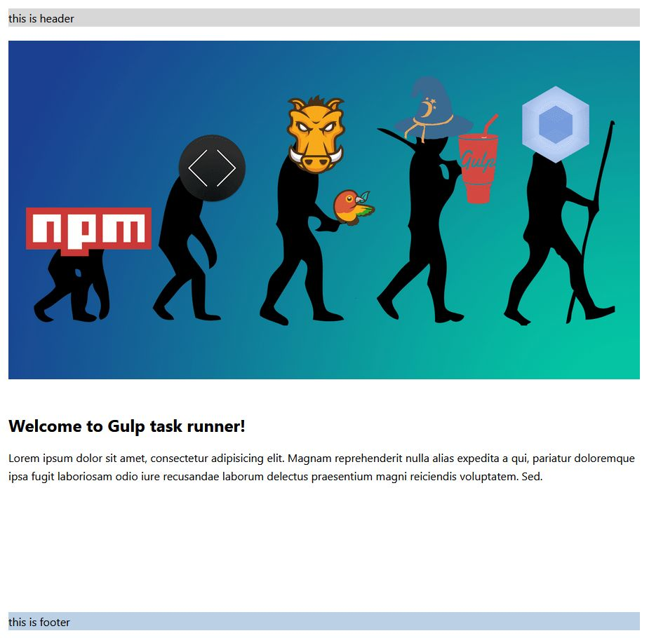

## Gulp task runner

:warning: permanent construction

**Directory tree structure**

```bash
.
├── gulpfile.js
├── package.json
├── package-lock.json
├── readme.md
└── src
    ├── assets
    │   ├── img
    │   │   ├── favicon
    │   │   │   ├── android-chrome-192x192.png
    │   │   │   ├── android-chrome-512x512.png
    │   │   │   ├── apple-touch-icon.png
    │   │   │   ├── browserconfig.xml
    │   │   │   ├── favicon-16x16.png
    │   │   │   ├── favicon-32x32.png
    │   │   │   ├── favicon.ico
    │   │   │   ├── mstile-150x150.png
    │   │   │   ├── safari-pinned-tab.svg
    │   │   │   └── site.webmanifest
    │   │   └── start
    │   │       ├── preview.png
    │   │       ├── screenshot-gtr.jpg
    │   │       ├── tree-C.jpg
    │   │       └── tree-n.jpg
    │   ├── js
    │   │   ├── app.js
    │   │   └── components
    │   │       ├── modal.js
    │   │       └── slick.js
    │   └── sass
    │       ├── abstract
    │       │   ├── constants.scss
    │       │   ├── mixins.scss
    │       │   └── placeholders.scss
    │       ├── blocks
    │       │   ├── footer.scss
    │       │   ├── header.scss
    │       │   ├── modal.scss
    │       │   └── page.scss
    │       ├── style.scss
    │       └── vendor
    │           └── slick.scss
    ├── index.html
    └── tpl
        ├── data
        │   └── data.json
        ├── layouts
        │   └── default.html
        └── partials
            ├── footer.html
            ├── header.html
            ├── head.html
            └── modal.html
```

## Code

package.json

```javascript
{
  "name": "gulp-task-runner",
  "version": "1.0.0",
  "description": "gulp4 runner",
  "author": "XZ",
  "devDependencies": {
    "browser-sync": "^2.26.3",
    "del": "^4.1.0",
    "gulp": "^4.0.0",
    "gulp-autoprefixer": "^6.0.0",
    "gulp-cssbeautify": "^1.0.1",
    "gulp-cssnano": "^2.1.3",
    "gulp-imagemin": "^5.0.3",
    "gulp-plumber": "^1.2.1",
    "gulp-rename": "^1.4.0",
    "gulp-rigger": "^0.5.8",
    "gulp-sass": "^5.0.0",
    "sass": "^1.36.0",
    "gulp-strip-css-comments": "^2.0.0",
    "gulp-uglify": "^3.0.2",
    "panini": "^1.6.3"
  }
}
```

gulpfile.js

```javascript
"use strict";

const { src, dest } = require("gulp");
const gulp = require("gulp");
const autoprefixer = require("gulp-autoprefixer");
const cssbeautify = require("gulp-cssbeautify");
const removeComments = require("gulp-strip-css-comments");
const rename = require("gulp-rename");
const sass = require("gulp-sass")(require("sass"));
const cssnano = require("gulp-cssnano");
const rigger = require("gulp-rigger");
const uglify = require("gulp-uglify");
const plumber = require("gulp-plumber");
const imagemin = require("gulp-imagemin");
const del = require("del");
const panini = require("panini");
const browsersync = require("browser-sync").create();

/* Paths */
var path = {
  build: {
    html: "dist/",
    js: "dist/assets/js/",
    css: "dist/assets/css/",
    images: "dist/assets/img/",
  },
  src: {
    html: "src/*.html",
    js: "src/assets/js/*.js",
    css: "src/assets/sass/style.scss",
    images: "src/assets/img/**/*.{jpg,png,svg,gif,ico}",
  },
  watch: {
    html: "src/**/*.html",
    js: "src/assets/js/**/*.js",
    css: "src/assets/sass/**/*.scss",
    images: "src/assets/img/**/*.{jpg,png,svg,gif,ico}",
  },
  clean: "./dist",
};

/* Tasks */
function browserSync(done) {
  browsersync.init({
    server: {
      baseDir: "./dist/",
    },
    port: 3000,
  });
}

function browserSyncReload(done) {
  browsersync.reload();
}

function html() {
  panini.refresh();
  return src(path.src.html, { base: "src/" })
    .pipe(plumber())
    .pipe(
      panini({
        root: "src/",
        layouts: "src/tpl/layouts/",
        partials: "src/tpl/partials/",
        helpers: "src/tpl/helpers/",
        data: "src/tpl/data/",
      })
    )
    .pipe(dest(path.build.html))
    .pipe(browsersync.stream());
}

function css() {
  return src(path.src.css, { base: "src/assets/sass/" })
    .pipe(plumber())
    .pipe(sass())
    .pipe(
      autoprefixer({
        Browserslist: ["last 8 versions"],
        cascade: true,
      })
    )
    .pipe(cssbeautify())
    .pipe(dest(path.build.css))
    .pipe(
      cssnano({
        zindex: false,
        discardComments: {
          removeAll: true,
        },
      })
    )
    .pipe(removeComments())
    .pipe(
      rename({
        suffix: ".min",
        extname: ".css",
      })
    )
    .pipe(dest(path.build.css))
    .pipe(browsersync.stream());
}

function js() {
  return src(path.src.js, { base: "./src/assets/js/" })
    .pipe(plumber())
    .pipe(rigger())
    .pipe(gulp.dest(path.build.js))
    .pipe(uglify())
    .pipe(
      rename({
        suffix: ".min",
        extname: ".js",
      })
    )
    .pipe(dest(path.build.js))
    .pipe(browsersync.stream());
}

function images() {
  return src(path.src.images).pipe(imagemin()).pipe(dest(path.build.images));
}

function clean() {
  return del(path.clean);
}

function watchFiles() {
  gulp.watch([path.watch.html], html);
  gulp.watch([path.watch.css], css);
  gulp.watch([path.watch.js], js);
  gulp.watch([path.watch.images], images);
}

const build = gulp.series(clean, gulp.parallel(html, css, js, images));
const watch = gulp.parallel(build, watchFiles, browserSync);

/* Exports Tasks */
exports.html = html;
exports.css = css;
exports.js = js;
exports.images = images;
exports.clean = clean;
exports.build = build;
exports.watch = watch;
exports.default = watch;
```

## Screenshot

<kbd>[](https://github.com/viktishchenko/gulp-runner)</kbd>

## Usage:

`npm i` → `gulp`
